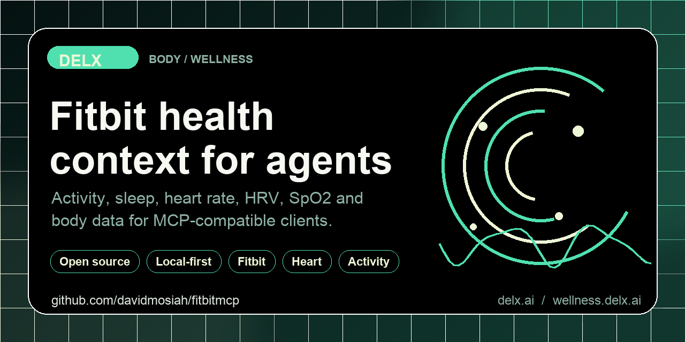

<!-- delx-wellness header v2 -->
<h1 align="center">Fitbit MCP</h1>

<div align="center">
  
</div>

<h3 align="center">
  Give your AI agent your Fitbit activity, sleep, heart and HRV data &mdash; locally.<br>
  Local-first MCP server &mdash; <strong>tokens never leave your machine</strong>.
</h3>

<p align="center">
  <a href="https://www.npmjs.com/package/fitbit-mcp-unofficial"></a>
  <a href="https://www.npmjs.com/package/fitbit-mcp-unofficial"></a>
  <a href="LICENSE"></a>
  <a href="https://wellness.delx.ai/connectors/fitbit"></a>
</p>

<p align="center">
  <a href="https://github.com/davidmosiah/fitbitmcp/stargazers"></a>
  <a href="https://modelcontextprotocol.io"></a>
  <a href="https://github.com/davidmosiah/delx-wellness-hermes"></a>
  <a href="https://github.com/davidmosiah/delx-wellness"></a>
</p>

> ⚡ **One-command install** with [Delx Wellness for Hermes](https://github.com/davidmosiah/delx-wellness-hermes):
> `npx -y delx-wellness-hermes setup` &mdash; preconfigures this connector and the other 8 in a dedicated Hermes profile.
>
> Or wire it standalone into Claude Desktop / Cursor / ChatGPT Desktop &mdash; see the install section below.

---

<!-- /delx-wellness header v2 -->

**Local-first MCP server that connects AI agents to your Fitbit activity, sleep, heart-rate, HRV, SpO2 and weight data.**

> **Unofficial project.** Not affiliated with, endorsed by or supported by Fitbit or Google. Use this only with your own Fitbit account and in line with the Fitbit Web API terms.

> **Platform migration risk:** Fitbit is migrating to the Google Health API. OAuth, base URL, scopes and reconnection flows may change in 2026. Treat any breakage as platform drift and check the [Fitbit Web API docs](https://dev.fitbit.com/build/reference/web-api/) before reporting it as a bug.

Built by [David Mosiah](https://github.com/davidmosiah) for people who use Claude, Cursor, Hermes, OpenClaw or other MCP-compatible agents to think about activity, sleep and heart context — without copy-pasting numbers from the Fitbit app.

Part of [Delx Wellness](https://github.com/davidmosiah/delx-wellness), a registry of local-first wellness MCP connectors.

> If this connector helps your agent workflow, please star the repo. Stars make the project easier for other AI builders to discover and help Delx keep shipping local-first wellness infrastructure.

## Why this exists

Fitbit (now under Google) has years of wearable data — daily activity, sleep stages, intraday heart-rate, HRV, SpO2, breathing rate, weight, food and water logs. But its API uses OAuth 2.0 with per-scope authorization and intraday access that varies by app, and the platform is mid-migration to the Google Health API.

This package handles the OAuth dance locally, normalizes responses, and exposes Fitbit through the Model Context Protocol. Tokens never leave your machine. Privacy-mode defaults keep raw payloads opt-in.

## Setup in 60 seconds

You'll need a Fitbit app ([create one here](https://dev.fitbit.com/apps)) with redirect URI `http://127.0.0.1:3000/callback`.

```bash
npx -y fitbit-mcp-unofficial setup    # interactive: paste client id + secret
npx -y fitbit-mcp-unofficial auth     # opens browser, captures the OAuth code
npx -y fitbit-mcp-unofficial doctor   # verifies you're ready
```

Recommended scopes:

```text
activity heartrate profile settings sleep weight nutrition
```

Then add this to your MCP client config:

```json
{
  "mcpServers": {
    "fitbit": {
      "command": "npx",
      "args": ["-y", "fitbit-mcp-unofficial"]
    }
  }
}
```

For Claude Desktop, run `setup --client claude` and the snippet is written for you.

## Try it with your agent

Three things to ask first:

```text
Use fitbit_connection_status to check setup, then run fitbit_daily_summary.
Give me a 5-line operating brief for today.
```

```text
Call fitbit_weekly_summary with response_format=json. Identify my biggest
sleep/activity bottleneck and give me a next-week plan.
```

```text
Use the fitbit_intraday_investigation prompt for date=today, detail_level=1min.
Don't claim anything Fitbit can't actually prove.
```

## Data availability

This package uses the official Fitbit Web API. When this README says `raw`, it means the upstream Fitbit JSON for a supported endpoint — not raw device sensor streams.

| Data | Available | Notes |
|---|:---:|---|
| Daily activity (steps, calories, distance, zones) | ✓ | Standard activity summaries |
| Activity logs | ✓ | Logged workouts |
| Sleep + sleep stages | ✓ | When Fitbit returns stage data |
| Resting heart rate + daily heart-rate zones | ✓ | All scored days |
| Intraday heart-rate samples | conditional | Only when the Fitbit app/API access permits intraday |
| HRV (overnight) | ✓ | When supported by device/account |
| SpO2 (overnight) | ✓ | When supported by device/account |
| Breathing rate | ✓ | When supported by device/account |
| Weight + body composition | ✓ | When logged |
| Food + water logs | ✓ | When logged |
| Continuous device telemetry | — | Not exposed by Fitbit's public API |

## Tools

**Start with these:**

- `fitbit_connection_status` — verify local setup before calling Fitbit
- `fitbit_data_inventory` — inventory supported data domains, scopes, privacy modes and recommended first calls without calling Fitbit APIs.
- `fitbit_daily_summary` — readiness, activity, sleep and heart context for today
- `fitbit_weekly_summary` — scorecard, comparison vs prior week, next-week plan

**Auth & diagnostics**

- `fitbit_capabilities`, `fitbit_agent_manifest`, `fitbit_privacy_audit`, `fitbit_cache_status`
- `fitbit_get_auth_url`, `fitbit_exchange_code`, `fitbit_revoke_access`

**Profile & devices**

- `fitbit_get_profile`, `fitbit_list_devices`

**Activity**

- `fitbit_get_activity_day`, `fitbit_list_activities`, `fitbit_get_activity`

**Sleep**

- `fitbit_get_sleep_day`, `fitbit_list_sleep`

**Heart & physiology** (each takes a `date`)

- `fitbit_get_heart_day`, `fitbit_get_heart_intraday`
- `fitbit_get_hrv_day`, `fitbit_get_spo2_day`, `fitbit_get_breathing_rate_day`

**Body & nutrition** (each takes a `date`)

- `fitbit_get_weight_day`, `fitbit_get_food_day`, `fitbit_get_water_day`

## Prompts

- `fitbit_daily_checkin` — practical daily health and activity check-in
- `fitbit_weekly_review` — review trends across activity, sleep and heart context
- `fitbit_intraday_investigation` — investigate one day's intraday heart-rate samples

## Resources

- `fitbit://capabilities`, `fitbit://agent-manifest`
- `fitbit://summary/daily`, `fitbit://summary/weekly`

## Privacy & security

- OAuth tokens are stored in `~/.fitbit-mcp/tokens.json` with `0600` permissions and are never returned by tools.
- The server never prints access or refresh tokens.
- `FITBIT_PRIVACY_MODE` defaults to `structured`. Raw Fitbit JSON is opt-in via `raw` mode or per-call override.
- Health data is sensitive — do not paste raw payloads publicly.
- This is **not medical advice**. The server exposes user-authorized data for personal AI workflows, not diagnosis or treatment.

## Configuration

`setup` writes most of these into `~/.fitbit-mcp/config.json` (`0600`). Manual env override is supported:

```bash
FITBIT_CLIENT_ID=…
FITBIT_CLIENT_SECRET=…
FITBIT_REDIRECT_URI=http://127.0.0.1:3000/callback

# Optional
FITBIT_SCOPES="activity heartrate profile settings sleep weight nutrition"
FITBIT_PRIVACY_MODE=structured        # summary | structured | raw
FITBIT_CACHE=sqlite                   # optional read-through cache
```

## Hermes / remote setup

```bash
npx -y fitbit-mcp-unofficial setup --client hermes --no-auth
npx -y fitbit-mcp-unofficial auth                       # run locally if browser auth is needed
npx -y fitbit-mcp-unofficial doctor --client hermes
hermes mcp test fitbit
```

After Hermes config changes, use `/reload-mcp` or `hermes mcp test fitbit`. Don't restart the gateway for normal data access.

If browser OAuth has to happen on a different machine than Hermes, run `auth` locally and copy `~/.fitbit-mcp/tokens.json` to the server with `chmod 600`.

## Requirements

- Node.js 20+
- A Fitbit app at <https://dev.fitbit.com/apps> with redirect URI `http://127.0.0.1:3000/callback`
- Intraday heart-rate access requires the Fitbit app to be approved for intraday data (varies per app)

## Development

```bash
git clone https://github.com/davidmosiah/fitbitmcp.git
cd fitbitmcp
npm install
npm test
npm run build
```

Test with MCP Inspector:

```bash
npx @modelcontextprotocol/inspector node dist/index.js
```

## Links

- npm: <https://www.npmjs.com/package/fitbit-mcp-unofficial>
- Docs site: <https://wellness.delx.ai/connectors/fitbit>
- Legacy docs: <https://fitbitmcp.vercel.app/>
- GitHub: <https://github.com/davidmosiah/fitbitmcp>
- Delx Wellness registry: <https://github.com/davidmosiah/delx-wellness>
- Connector quality standard: <https://github.com/davidmosiah/delx-wellness/blob/main/docs/connector-quality-standard.md>
- Fitbit Web API: <https://dev.fitbit.com/build/reference/web-api/>

<!-- delx-wellness see-also -->

## See also

The full [Delx Wellness](https://wellness.delx.ai) connector library:

| Provider | Package | Repo |
|---|---|---|
| WHOOP | [`whoop-mcp-unofficial`](https://www.npmjs.com/package/whoop-mcp-unofficial) | [whoop-mcp](https://github.com/davidmosiah/whoop-mcp) |
| Oura | [`oura-mcp-unofficial`](https://www.npmjs.com/package/oura-mcp-unofficial) | [ouramcp](https://github.com/davidmosiah/ouramcp) |
| Garmin | [`garmin-mcp-unofficial`](https://www.npmjs.com/package/garmin-mcp-unofficial) | [garminmcp](https://github.com/davidmosiah/garminmcp) |
| Strava | [`strava-mcp-unofficial`](https://www.npmjs.com/package/strava-mcp-unofficial) | [strava-mcp](https://github.com/davidmosiah/strava-mcp) |
| Fitbit | [`fitbit-mcp-unofficial`](https://www.npmjs.com/package/fitbit-mcp-unofficial) | [fitbitmcp](https://github.com/davidmosiah/fitbitmcp) |
| Withings | [`withings-mcp-unofficial`](https://www.npmjs.com/package/withings-mcp-unofficial) | [withingsmcp](https://github.com/davidmosiah/withingsmcp) |
| Apple Health | [`apple-health-mcp-unofficial`](https://www.npmjs.com/package/apple-health-mcp-unofficial) | [apple-health-mcp](https://github.com/davidmosiah/apple-health-mcp) |
| Polar | [`polar-mcp-unofficial`](https://www.npmjs.com/package/polar-mcp-unofficial) | [polarmcp](https://github.com/davidmosiah/polarmcp) |
| Nourish (nutrition) | [`wellness-nourish`](https://www.npmjs.com/package/wellness-nourish) | [wellness-nourish](https://github.com/davidmosiah/wellness-nourish) |

**One-command setup for Hermes** — preconfigures every connector above plus wellness skills + onboarding: [`delx-wellness-hermes`](https://github.com/davidmosiah/delx-wellness-hermes).

<!-- /delx-wellness see-also -->

## License

MIT — see [LICENSE](LICENSE).

## Disclaimer

This software is provided as-is. It is not a medical device, does not provide medical advice, and should not be used for diagnosis or treatment. Fitbit is migrating to the Google Health API; the integration boundary may change. Always consult qualified professionals for medical concerns.
